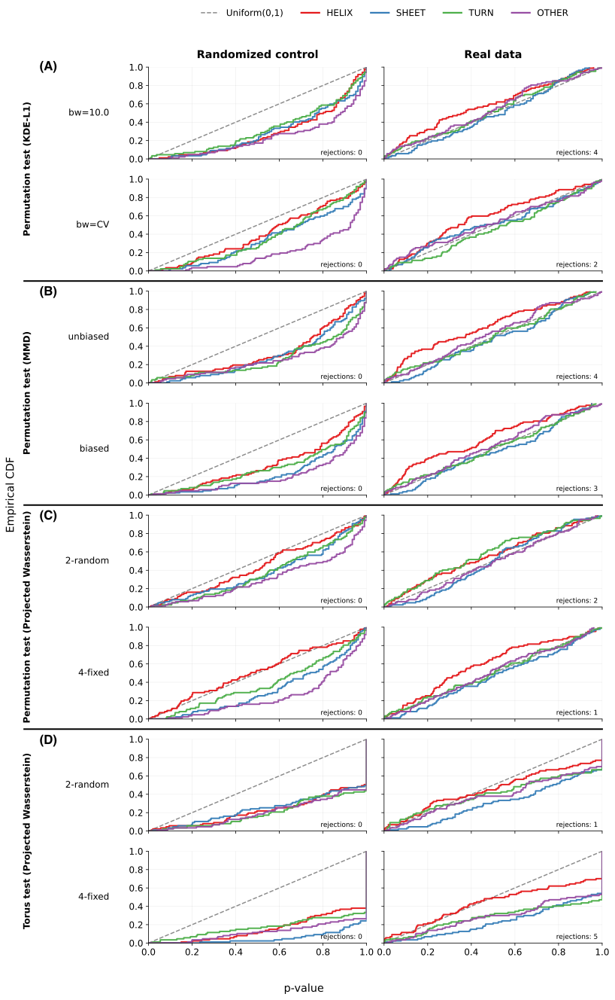
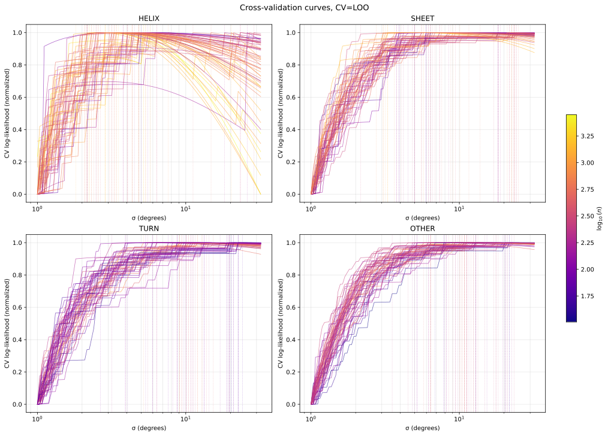
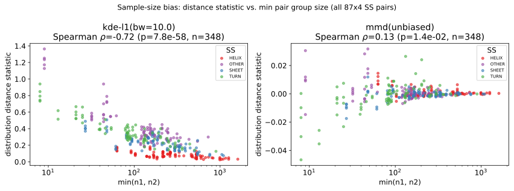
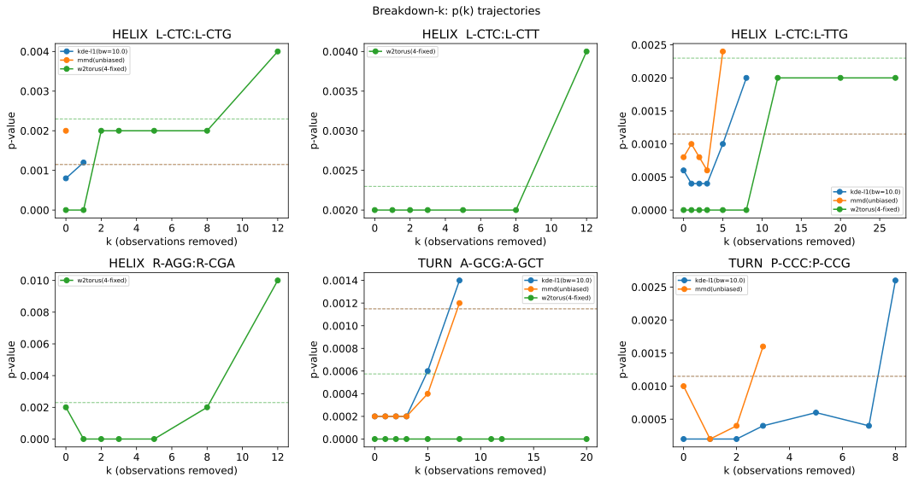
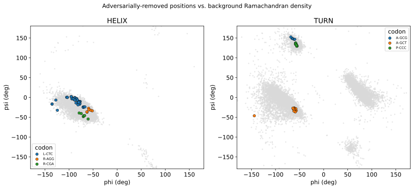

# PNAS 2026 Brief Report Code Guide

This document describes the code used to produce the analyses and figure for:

> Aviv A. Rosenberg, Ailie Marx, Alex M. Bronstein.
> *Statistical signals indicate a dependence between amino acid backbone conformation and the translated synonymous codon.*
> Brief Report, under review at PNAS, 2026.

The Brief Report revisits the 2022 Nature Communications analysis using four
independent statistical frameworks, each run twice: once on the real dataset and once on
a randomized-codon control. This document shows how to reproduce every cell of Figure
1 and where the outputs land.

**All data and outputs** referenced below are included in `pnas-2026-rev3.zip`, archived in this directory. Paths like `dataset-raw/`, `dataset-processed/`, and `robustness/` refer to directories within that zip.

## Overview

Four statistical tests are applied pairwise to every pair of synonymous codons,
conditioned on secondary structure (HELIX / SHEET / TURN / OTHER):

| Paper panel | Test statistic | P-value | Notes |
|---|---|---|---|
| **Figure 1A** | KDE-L1 on the flat torus | Permutation test (K=5000) | Two bandwidth modes: fixed (σ=10°) and per-(codon, SS) cross-validated. The original 2022 statistic, now without the invalid bootstrap wrapping and with principled bandwidth selection. |
| **Figure 1B** | Squared MMD (Gaussian kernel, σ=10°) on the flat torus | Permutation test (K=5000) | Unbiased (U-statistic, default) and biased (V-statistic) variants. Added to give a sample-size-unbiased alternative to KDE-L1 (Spearman(min n, ddist) ≈ +0.04 vs. KDE-L1's ≈ −0.64); see the SI's MMD section for the full statistic and `mmd_test_fast`'s Gram row-sum-identity permutation speedup. |
| **Figure 1C** | Projected Wasserstein on the torus (González-Delgado) | Permutation test (K=5000) | Same permutation test as Fig 1A, same test-statistic as Fig 1C. |
| **Figure 1D** | Projected Wasserstein on the torus (González-Delgado) | Analytic (no permutations) | Full test as proposed by González-Delgado et al. (PNAS 2025). 2 random or 4 fixed projection directions. |



**Figure 1**: p-value CDFs for all four statistical tests (panels A–D) across secondary-structure classes, comparing real data (colored curves) vs. randomized control (gray). Panels A–C use permutation tests (K=5000); panel D uses the analytic framework of González-Delgado et al.

For each configuration we run **two versions**:

- **Real dataset** (`RANDOMIZE_CODONS="none"`) — the actual E. coli dataset.
- **Randomized control** (`RANDOMIZE_CODONS="aa_ss"`) — codon labels shuffled within
  each (amino-acid, secondary-structure) bucket, preserving marginal codon frequencies
  per SS class. Used to verify that the test does not produce spurious rejections under
  the null.

Each combination of (statistical test, randomization) produces one output folder
containing a `cc-pvals.csv` file. The notebook then aggregates all of these into the
final figure.

## Dataset

Assumed to be at:

```
out/prec-collected/20211001_124553-aida-ex_EC-src_EC/
```

Can be obtained from the original dataset location (https://doi.org/10.7910/DVN/5P81D4).

Files:
- `data-precs.csv` — main dataset (357k rows, one per residue). Key columns: `pdb_id`,
  `unp_id`, `unp_idx`, `codon`, `codon_score`, `secondary` (DSSP), `phi`, `psi`.
- `meta-structs_all.csv`, `meta.json`, etc. — metadata about the PDB structures that were used.

The dataset pairs each residue in the E. coli proteome with the specific synonymous
codon that produced it. This matching is unique to our pipeline and not available in
standard structural databases.

The analysis applies these preprocessing steps:

1. Filter rows with missing `secondary`, `unp_idx`, or ambiguous codons (`codon_score < 1.0`).
2. Condition on secondary structure (DSSP type → consolidated type).
3. Optionally randomize codon labels within AA+SS groups (the control).
4. Aggregate redundant copies of the same residue across PDB entries (centroid angle on
   the torus for all structures matching `(unp_id, unp_idx, codon)`).

### Dataset copies shipped with the submission

For convenience (so the robustness/biology scripts and `robustness-figures.ipynb` don't need a
full pipeline run or the original DVN download to work), `pnas-2026-rev3.zip` carries two static
copies:

- **`dataset-raw/`** — a copy of the raw dataset above (`data-precs.csv`,
  `meta.json`), byte-identical to the DVN-sourced original.
- **`dataset-processed/dataset.csv`** — a copy of the aggregated/preprocessed
  dataset (the output of `analyze_pointwise.py`'s pipeline, i.e. *after* preprocessing steps
  1-4 above, not the raw per-structure data). This is the file every downstream script in
  `scripts/pnas2026/` and `notebooks/pnas2026/robustness-figures.ipynb` reads by default.

These two paths are the hardcoded defaults everywhere downstream (overridable via a positional
argv path for the scripts); they are not tied to any particular pipeline run's internal tag, so
they stay stable even if the full pipeline is re-run under a different tag.

## Key files

### Driver script: `scripts/analyze_pointwise.py`

A thin wrapper that sets a config (as module-level constants) and invokes the
`pp5 analyze-pointwise` CLI in a subprocess. Writes a log file and the analysis outputs
to `OUT_DIR`.

Critical constants:

| Constant | Values for the Brief Report | Meaning |
|---|---|---|
| `DDIST_STATISTIC` | `"kde_g"`, `"torus_perm"`, `"torus_p"`, `"mmd"`, `"mmd_biased"` | Which statistical test to run. `"mmd"` is the unbiased U-statistic (default), `"mmd_biased"` the biased RBF-MMD V-statistic; both use `DDIST_KERNEL_SIZE=10` (σ=10°, matching Alex's original robustness scripts). |
| `DDIST_K` | `5000` for permutation tests; `0` for `torus_p` | Number of permutations. |
| `DDIST_BS_NITER` | `1` | **Must stay at 1.** Disables the bootstrap-over-permutation-tests loop that was flagged as statistically invalid in González-Delgado et al. |
| `DDIST_KERNEL_SIZE` | -1, 10 | KDE kernel bandwidth in **degrees** for `kde_g`. Negative means select via cross-validation. |
| `DDIST_TORUS_N_PROJECTIONS` | `2` or `4` | Number of torus geodesic projections (only for `torus_*`). |
| `DDIST_TORUS_RANDOM_PROJECTIONS` | `True` (random) or `False` (fixed) | Projection strategy (only for `torus_*`). |
| `RANDOMIZE_CODONS` | `"none"` or `"aa_ss"` | Run on real data or randomized control. |
| `SELF_TEST` | `False` | Compares codon to itself as a control. Must stay False since we use a randomization control instead. |
| `FDR` | `0.05` | Benjamini–Hochberg FDR target. |
| `OUT_DIR` | `"out/pnas-2026"` | Where to write results. |

Other useful flags:
- `PROCESSES` — number of parallel workers (default 4). The permutation tests are very
  slow, use useful to parallize codon pairs. 
- `DDIST_K_MIN=100`, `DDIST_K_TH=100` — early-termination thresholds for permutation
  tests (stops permuting if the p-value is above a threshold after some number of iterations).

The script auto-generates a `tag` from the config; the tag becomes the name of the
output folder. This makes it safe to run multiple configurations in sequence without
overwriting each other.

### Analysis module: `src/pp5/analysis/pointwise.py`

The main analysis class is `PointwiseCodonDistanceAnalyzer`. It runs a 9-stage pipeline:

1. `_preprocess_dataset` — load CSV, filter, aggregate redundant residues, optionally
   randomize codons.
2. `_create_tuples_dataset` — create residue tuples (`tuple_len=1` for the Brief Report,
   so effectively a pass-through).
3. `_dataset_stats` — compute per-SS codon / AA frequency tables.
4. `_kernel_bandwidths` — build the per-(codon, SS) kernel-bandwidth table consumed by
   the `kde_g` test statistic. Either runs LOO cross-validation
   (`DDIST_KERNEL_SIZE <= 0`) or assigns the same fixed σ to every group
   (`DDIST_KERNEL_SIZE > 0`). See the "Bandwidth cross-validation" section below.
   Skipped for non-`kde_g` statistics.
5. `_pointwise_dists_dihedral` — the core step. Loops over every synonymous codon
   pair × SS group and computes `(ddist, pval)` in parallel workers. For `kde_g` it
   looks up `(σ_1, σ_2)` per pair from the bandwidth table.
6. `_kde_groups`, `_kde_subgroups` — estimate KDE Ramachandran plots (for downstream
   plotting only; not part of the statistical test).
7. `_write_pvals` — apply Benjamini–Hochberg per SS group and write
   `pvals/cc-pvals.csv`.
8. `_plot_results` — auxiliary plots.

Each stage caches its output as a pickle in `_intermediate_/`. If a stage's pickle is
found the stage is skipped, which makes runs resumable.

### Statistical tests: `src/pp5/stats/two_sample/` (`common.py`, `tw.py`, `mmd.py`, `kde.py`, `torustests.py`)

The three test functions used in the Brief Report:

- `kde2d_test_pergroup` — KDE-L1 permutation test. Each observation is expanded into a (128, 128)
  kernel slab on a flat-torus grid using a Gaussian kernel with wraparound
  (`torus_gaussian_kernel_2d` in `distributions/kde.py`). Permutations shuffle which
  slabs go into group X vs group Y.
- `torus_projection_permutation_test` — wraps González-Delgado's projected-Wasserstein
  statistic inside our permutation framework. Calls their R package `torustest` via
  `rpy2` to compute the statistic for each permutation.
- `torus_projection_test` — the full statistical test as proposed in González-Delgado et
  al., computing p-values analytically from a simulated null distribution. No
  permutations involved. The simulated null is cached in
  `torustest_null_<nsim>_<n>.pkl`.

Common helpers: `mht_bh` (Benjamini–Hochberg) in `src/pp5/stats/mht.py`.

### Bandwidth cross-validation: `src/pp5/distributions/bandwidth_cv.py`

For the `kde_g` (KDE-L1) test, the kernel bandwidth σ is selected per (codon, SS) group
by leave-one-out cross-validation of the KDE log-likelihood — replacing the manual sweep
over a fixed range used in the originally submitted version. This addresses Reviewer 2's
bandwidth concern by tying σ to per-group sample size and density geometry rather than
choosing a single global value, and is justified statistically in
`docs/kernel_bandwidth_cv.md`.

The CV is integrated into the analysis pipeline as the `_kernel_bandwidths` stage:

- **Fixed bandwidth** (`DDIST_KERNEL_SIZE > 0`): the same σ is assigned to every group
  via `uniform_bandwidth_table`. The downstream double-slab machinery is used uniformly,
  so the fixed and CV paths share the same code.
- **CV bandwidth** (`DDIST_KERNEL_SIZE <= 0`): `run_bandwidth_cv` runs LOO-CV over a
  log-spaced grid of 100 bandwidths from 1° to 32° per (codon, SS) group with at least
  30 observations. Selection rule: the smallest σ within 1% of the LL range from the
  maximum (a plateau-aware rule that prefers sensitivity on flat tails). For groups
  below the 30-sample threshold a fallback σ — the median CV bandwidth among
  non-fallback groups sharing the same (AA, SS) — is used, with the global cross-SS
  median as a secondary fallback if the (AA, SS) bucket is empty.



**Figure S1**: Leave-one-out cross-validation curves for each codon and secondary-structure class. Each curve shows the KDE log-likelihood at different bandwidth values. Dashed lines indicate the selected per-codon bandwidth, chosen via the plateau-aware rule: the smallest σ within 1% of the maximum log-likelihood range. Where plateaus exist, this rule selects the most sensitive bandwidth that the data cannot meaningfully distinguish from optimality.

The result is written to `kernel_bandwidths.csv` in the run output directory and used
downstream by `kde2d_test_pergroup` to apply the per-group σ at permutation time.

**Statistical validity**. The test statistic treats `(σ_1, σ_2)` as
fixed nuisance constants — they are precomputed once from the original (un-permuted)
codon labels and never updated. The bandwidth attaches to the *group role*, not to the
observation: every observation in a pair `(c_1, c_2)` is precomputed into two slabs
(at σ_1 and σ_2), and the slab read at each permutation depends on the group the
observation currently occupies. Permuting labels leaves `(σ_1, σ_2)` unchanged, so the
permutation distribution remains exchangeable under H_0 and the resulting p-value is
valid.

#### Standalone CV exploration: `notebooks/kernel_bandwidth_cv.ipynb`

Standalone notebook that runs the same CV procedure outside the analysis pipeline.
Useful for inspecting LL-vs-σ curves per (codon, SS), the σ-vs-n summary plot, and for
the supplementary CV figures that ship with the Brief Report. 

### Figure notebook: `notebooks/pnas2026/main-figures.ipynb`

Consolidates the p-values from all 12 runs (6 test configurations × {real, randomized}) and produces Figure 1 of the Brief Report.

The notebook is driven by a `LABELLED_TAGS` dictionary that maps human-readable labels
(e.g. `"kde-l1(K=5000, bw=cv); aa_ss"`) to the output folder name produced by the
driver script. After loading all `cc-pvals.csv` files, the notebook:

1. Concatenates everything into `df_all_pvals`.
2. Applies Benjamini–Hochberg from raw p-values at FDR=0.05 across all AA, per SS (87
   hypotheses). Saved as `rejections.csv`.
2. Plots p-value CDFs per SS group, one subplot per (statistical test, randomization).

## Reproducing the Brief Report figure

### Prerequisites

- The `pp5` Python package installed (see the top-level `README.md` for environment
  setup via `conda`).
- The dataset folder `out/prec-collected/20211001_124553-aida-ex_EC-src_EC/` present (only
  needed to re-run the pipeline from scratch; not needed for the robustness/biology scripts or
  `robustness-figures.ipynb`, which read the static copies under `` -- see
  "Dataset copies shipped with the submission" above).

### Running one configuration

Edit the constants at the top of `scripts/analyze_pointwise.py` and run:

```bash
./scripts/analyze_pointwise.py
```

Each run writes to `<auto-generated-tag>/`.
Note that a full run can takes several hours, especially for the permutation tests. Use
parallelization via the `PROCESSES` option and run on a machine with many cores if
possible.

### Running all configurations

For the Brief Report we ran the following 16 configurations (8 × 2):

**Figure 1A — KDE-L1 permutation tests.** Set `DDIST_STATISTIC="kde_g"`, `DDIST_K=5000`,
`DDIST_BS_NITER=1`. Two bandwidth modes:

- Fixed σ = 10°: `DDIST_KERNEL_SIZE=10`.
- CV per (codon, SS): `DDIST_KERNEL_SIZE=-1`. The pipeline runs LOO-CV inside the
  `_kernel_bandwidths` stage and writes `kernel_bandwidths.csv` next to the run output.
  CV is recomputed independently for the real and randomized datasets, so the only
  difference between the two runs is the codon labels themselves.

Each bandwidth mode runs in both `RANDOMIZE_CODONS="none"` and `"aa_ss"` (4 runs total).

**Figure 1B — MMD² permutation tests.** Set `DDIST_STATISTIC="mmd"` (unbiased) or
`"mmd_biased"` (biased), `DDIST_K=5000`, `DDIST_KERNEL_SIZE=10`. Each in both
randomization modes (4 runs total).

**Figure 1C — Wasserstein permutation tests.** Set `DDIST_STATISTIC="torus_perm"`,
`DDIST_K=5000`, `DDIST_BS_NITER=1`. Same projection settings as 1B (4 runs total).

**Figure 1D — Full González-Delgado analytic test.** Set `DDIST_STATISTIC="torus_p"`,
`DDIST_K=0`. Run with `(n_projections=2, random=True)` and `(n_projections=4, random=False)`,
each in both randomization modes (4 runs total).

### Generating the figure

After all runs are complete, open `notebooks/pnas2026/main-figures.ipynb` and run all cells.
`BASE_PATH` already points at `` (the real run output, not a legacy path) and
every path in `LABELLED_CSV_PATHS`/`LABELLED_TAGS` (shared with `robustness-figures.ipynb`
via `_pnas2026_common.py`) is asserted to exist in an early cell.

The figure is saved as `figs/pvals_cdf-FDR=0.05.pdf`.

### Robustness figures and tables

`notebooks/pnas2026/robustness-figures.ipynb` is a separate notebook (load+plot only, per the
project's own convention) that consumes the same `cc-pvals.csv` files and produces the
adversarial breakdown-k analysis: candidate-pairs table, per-arm breakdown-k (KDE-fix, KDE-CV,
MMD-unbiased, MMD-biased, torus-W2), the joined breakdown-k matrix, PDB provenance, and figures.
See that notebook's own markdown cells for details; outputs land under `robustness/`.



**Figure S2**: Distribution distance as measured with KDE-L1 and unbiased MMD², versus the minimum sample size in each compared pair. KDE-L1 distances decrease with larger samples (sample-size bias), whereas the unbiased U-statistic MMD² shows no such bias.



**Figure S3**: Breakdown-k trajectories for the six statistically significant codon pairs across the three main statistical tests (KDE-L1, MMD², Wasserstein). Each trajectory shows how the p-value changes as adversarial points (potential outliers or data errors) are progressively removed, validating the robustness of the signal.



**Figure S4**: (φ, ψ) locations of every breakdown-set residue overlaid on the background Ramachandran density for each secondary-structure class. Breakdown-set points cluster within densely populated, physically allowed regions rather than scattering into sparse or disallowed areas, indicating that residues flagged by adversarial search are ordinary, well-populated conformations, not geometric outliers or data errors.

**Figure S5 (see `figs/fig_s5.pdf`)**: Structural inspection of breakdown-set residues. Representative residues identified by the breakdown-k analysis are shown in their local structural environment alongside experimental density maps. Residues are well-fitted to density with no obvious modelling or technical abnormalities. Notable patterns: CTC-encoded leucines in helix-associated signals frequently locate near secondary-structure boundaries; CCC-encoded prolines in turn-associated signals are typically followed by glycine.

### Robustness and biological-significance scripts (`scripts/pnas2026/`)

Standalone scripts (not part of the `analyze_pointwise.py` pipeline) supporting the Brief
Communication's robustness and biological-significance analysis, in the original
single-residue setting (per amino acid, comparing synonymous codons within each
secondary-structure class). Run individually from the repo root:

```bash
PYTHONPATH=src conda run -n pp5 python -u scripts/pnas2026/<script>.py
```

Input data: `dataset-processed/dataset.csv` (aggregated, post-preprocessing --
the default every script below reads) and `dataset-raw/data-precs.csv` (raw
per-structure, used for PDB provenance) -- see "Dataset copies shipped with the submission"
above. Each script also takes an optional positional argument to override the dataset path.

**Core statistic:** `robustness_mmd.py` -- unbiased/biased MMD², flat-torus Gaussian kernel,
fast permutation, breakdown-k.

**Robustness / statistics:**
- `robustness_outliers.py` -- KDE-L1 breakdown-k arm + controls
- `robustness_torus.py` -- torus projected-Wasserstein breakdown-k arm
- `robustness_cv.py` -- KDE cross-validated bandwidth (double-slab)
- `spurious_control.py` -- spurious-but-significant reference for breakdown-k
- `clean_aggregation.py` -- outlier-robust re-aggregation sensitivity
- `worst_sample_angles.py`, `compare_spread.py` -- adversarial-sample angles & spread

**Biological significance:**
- `directional_speed.py`, `directional_speed_mmd.py` -- translation-speed (Chevance 2014) test
- `per_aa_directional.py` -- per-AA directional speed→angle trend
- `bfactor_analysis.py` -- B-factor / flexibility control
- `expression_confound.py`, `expression_confound_mmd.py` -- PaxDb expression stratification
- `codon_optimality.py`, `make_codon_table_fig.py` -- codon speed/tRNA table & figure

## Output folder structure

Each run produces:

```
<OUT_DIR>/<run_tag>/
├── _intermediate_/             # resumable pipeline state (pickles)
│   ├── dataset.pkl
│   ├── group-sizes.pkl
│   ├── kernel-bandwidths.pkl   # cached bandwidth table (kde_g only)
│   └── ...
├── pvals/
│   └── cc-pvals.csv            # main output: one row per (SS, codon_i, codon_j)
├── kernel_bandwidths.csv       # per-(codon, SS) σ table (kde_g only; CV or fixed)
└── ...                         # auxiliary plots from _plot_results
```

Columns in `cc-pvals.csv`:

| Column | Description |
|---|---|
| `condition_group` | Secondary structure class: `HELIX`, `SHEET`, `TURN`, or `OTHER`. |
| `subgroup1`, `subgroup2` | Codon pair, e.g. `L-CTC`, `L-CTG`. |
| `n1`, `n2` | Sample sizes for each codon after aggregation. |
| `phi1_mean`, `psi1_mean`, `phi2_mean`, `psi2_mean` | Circular mean angles per codon. |
| `d12` | Centroid distance between the two codon distributions on the torus. |
| `pval` | Raw p-value from the chosen statistical test. |
| `ddist` | Test-statistic value (KDE-L1 distance, Wasserstein distance, etc.). |
| `significant` | Boolean — whether this pair was BH-rejected at `FDR=0.05` within its SS group. The notebook ignores this column and re-applies BH from raw p-values. |

## Run tag format

The auto-generated tag follows:

```
pointwise_cdist-t=<TUPLE_LEN>-bs=<BS_NITER>-k=<K>-nmax=<NMAX>-<stat_tag>-cr=<RAND>-noself
```

Where `<stat_tag>` is:

- `kde_g_bw=<bw>` — KDE-L1 at fixed bandwidth `<bw>` in degrees (e.g. `kde_g_bw=10`).
- `kde_g_bw=cv` — KDE-L1 with cross-validated per-(codon, SS) bandwidths (set
  `DDIST_KERNEL_SIZE=-1`).
- `torus_p_nproj=<N>_randproj=<True|False>` — for the full González-Delgado analytic test.
- `torus_perm_nproj=<N>_randproj=<True|False>` — for the Wasserstein permutation test.

Note on the `kde-l1(K=5000, bw=10.0)` runs: the corresponding folders use a legacy tag
format (`pointwise_cdist-manual-t_1-bs_1-k_5000-nmax_0-kde_g_10.0-cr_none-noself`) from
before the current script was finalized. The notebook's `LABELLED_TAGS` dict hardcodes
this exception. New runs at any bandwidth — fixed or CV — use the modern format.

## What not to change

A few settings were held fixed for the Brief Report and should not be changed when
reproducing the figure:

- `DDIST_BS_NITER=1` — keep this at 1 to disable bootstrapping over permutation tests.
- `SELF_TEST=False` — always False for randomized runs.
- `TUPLE_LEN=1` — the Brief Report analyses single residues, not pairs.
- `COMPARISON_TYPES=["cc"]` — only codon–codon comparisons are relevant.
- `DDIST_N_MIN=2` — required for the permutation test to be well-defined.
